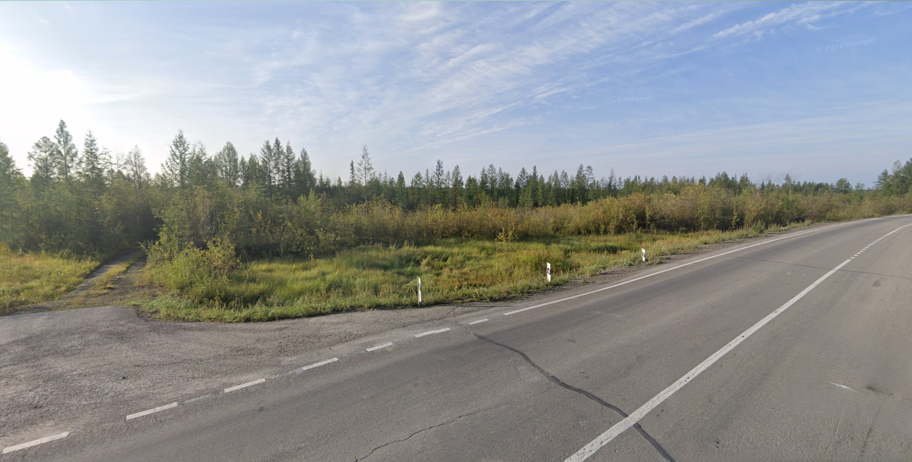
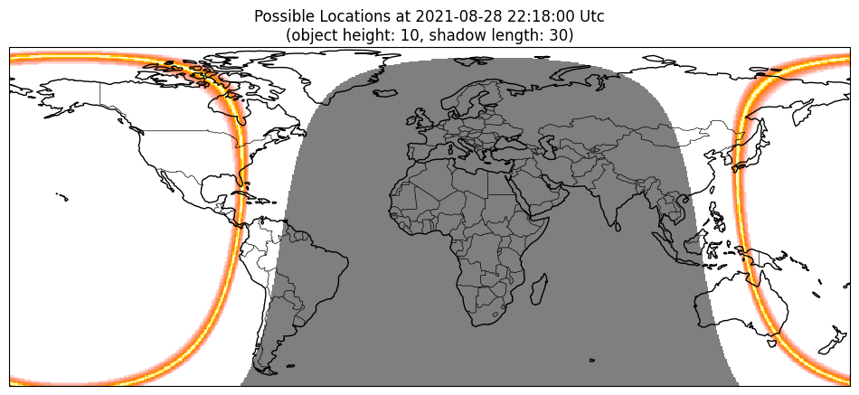
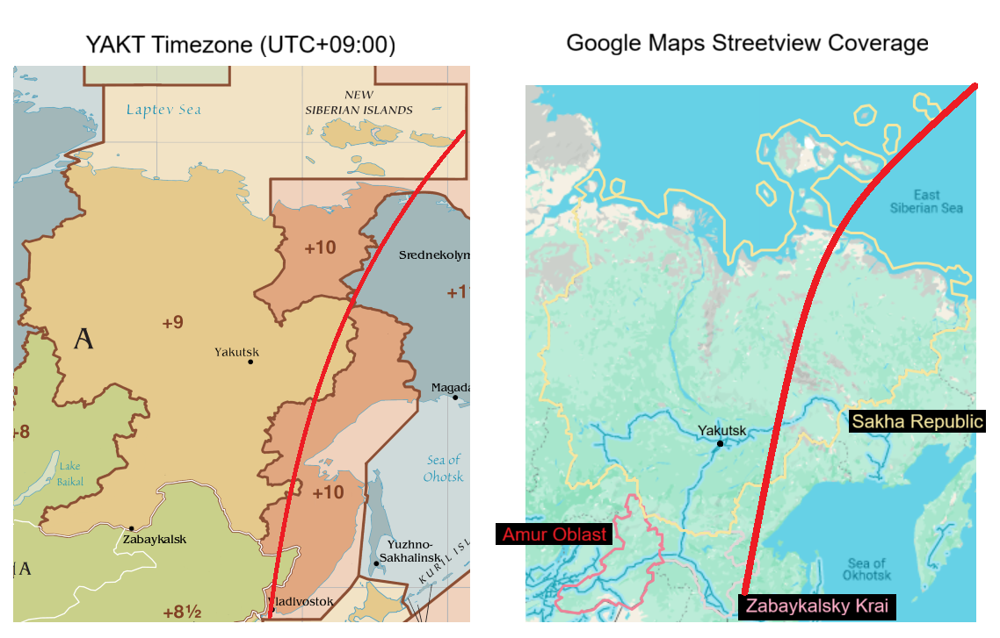

# Solution

The aim of this challenge is to find a precise location (latitude and longitude) on a map. The general approach for problems like this is to narrow in on our solution step-by-step. Think of it like a shrinking radius of possible locations - how can you find what country this is in, then what region in that country, etc.? Your goal should always be to eventually narrow in on a region small or sparse enough, before going through it with a fine-tooth comb.


### Step 1: Analyse Image


1. Landscape is a [Taiga/ Boreal forest](https://en.wikipedia.org/wiki/Taiga) (via Google Lens reverse image search) --> High northern latitude
2. Paved road with **all-white** road lines --> Unlikely to be USA/Canada
3. White bollard with a black stripe and white reflector. Bollard is thin, flat and attached to a stick --> [Typical Russian bollard](https://www.plonkit.net/russia)

Just from observing the image alone, we can already conclude we are most likely in Northern Europe or Asia, possibly in Russia.

### Step 2: EXIF Data
Anytime you are given an image, always view its EXIF data. You can use an EXIF viewer such as [ExifTool.](https://exif.tools/) In your results, you should notice the following:

1. **Date/Time Original** = 2021:08:29 07:18:00
2. **Offset Time Original** = +09:00

This means the image was taken on **29 August 2021**, at **7:18AM** in a timezone that is running 9 hours ahead of Coordinated Universal Time (i.e. **UTC+09:00**). 

This confirms our earlier hypothesis in step 1, as North America runs behind UTC and Nordic countries run about UTC+00:00 to +02:00. Russia, on the other hand, has [11 time zones](https://en.wikipedia.org/wiki/UTC%2B09:00#/media/File:Map_of_Russian_time_zones_(2020)_-_without_Crimea.svg), one of which, **Yakutsk Time (YAKT)**, is in fact **UTC+09:00**.


### Step 3: Prompt
As a reminder, the prompt is:
```
i pet a Bell i rIng a Cat
i'm hidden and cannot be found
what time of day, what Shadows play
with sticks in gravel ground?
```
If you assemble all the capitalised words together, they form the phrase "Bell Ing Cat Shadows". Search this up to find the [Bellingcat Shadow Finder tool](https://github.com/bellingcat/ShadowFinder). Based on the date, time and object-to-shadow ratio, this tool can find possible areas in the World an image could have been taken at.


### Step 4: Putting it All Together!

1. Measure the object-to-shadow ratio of the bollard using any image tool of your choice. I measured the bollard to be about **74-76 pixels** tall and its shadow to be **228-233 pixels** long. That is a ratio of about **1:3**.

*NOTE: the Bellingcat tool requires the shadow to be 90 degrees to the object to be fully accurate. The bollard in our image isn't exactly perpendicular to its shadow but it's close. Since the tool does have some in-built tolerance, for our purposes, the image doesn't need to be adjusted.*

2. Convert the EXIF date/time into UTC: August 29 2021, 07:18AM, UTC+09:00 converts into **August 28 2021, 10:18PM, UTC**.

3. Run the tool and we get the following result:
 We observe a band that passes through Canada, USA, Panama, Costa Rica, Cuba, Australia, Indonesia, Japan and Russia. But as we concluded earlier in step 2, we know the image is in Russia. The band just helps us to narrow down where in the YAKT timezone the image was taken. 

4. Overlay our results with the boundaries of the YAKT timezone. I've roughly done so in the following diagram, with the thick red lines:

The band crosses the eastern-most nub of Zabaykalsky Krai and an area in Sakha Republic east of Yakutsk. However, looking at these on Google Maps we can see that street view exists only in the latter region. We can conclude that the location is along the road (**P-504 highway**) east of Yakutsk, near the mountain range.

4. Observing the image again, we can see that the road bends up ahead. Search along the aformentioned section of the P-504, focusing on areas before a bend in the road.


**Location: [62.7854231,136.8499532](https://maps.app.goo.gl/ZDgg4Db8q8FDykYu9)**


## AUTHOR'S NOTE
I designed this to have mostly 'accurate' data. The month (August 2021) used in the EXIF data is the same month Google Maps Street View claims to have captured this image. I then picked a random date in August and reverse engineered a time of day that made sense with the shadows present, using https://www.suncalc.org/. By making things more 'authentic', I hoped I created opportunities for several alternative solution pathways. Here's one that doesn't require Shadow Finder.

#### Alternative Solution
As before, conclude this is Russia's YAKT timezone from the bollards and EXIF data. Across all federal subjects of Russia that are in YAKT timezone (Zabaykalsky Krai, Amur Oblast and the western half of Sakha Republic), August 2021 coverage exists ONLY in Sakha Republic (you may check using https://map-degen.vercel.app/). This leaves you with just the western half of Sakha Republic ([the eastern side is UTC+10:00 or UTC+11:00](https://en.wikipedia.org/wiki/Sakha_Republic#/media/File:UTC_hue4map_RUS-SA_2011-09-01.svg)).

Next, we observe the street view coverage in that region. The road south of Yakutsk was photographed during/after a rain. The road west of Yakutsk mostly has an orange hazy coverage. The road north of Yakutsk is overcast and hazy. It is unlikely any of these roads, which essentially leaves us with the P-504 between Yakutsk and the mountains in the east. 

Our image depicts one of the few paved stretches of road in that area. The vast majority of the P-504 is unpaved, with the paved sections occuring near towns/villages marked on the map. Check those first.


## RESOURCES
1. Bellingcat Shadow Finder: https://github.com/bellingcat/ShadowFinder
2. Russia Plonkit Guide: https://www.plonkit.net/russia
3. Russia Timezones: https://en.wikipedia.org/wiki/Time_in_Russia
