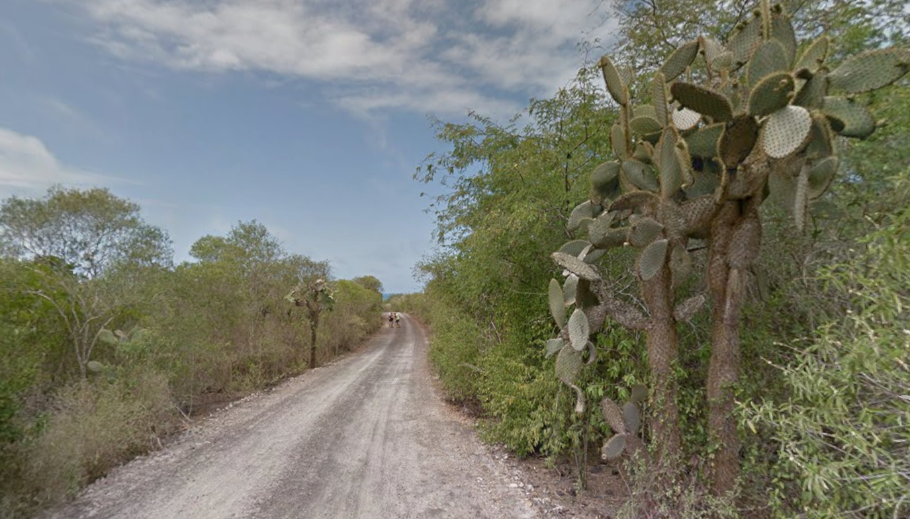
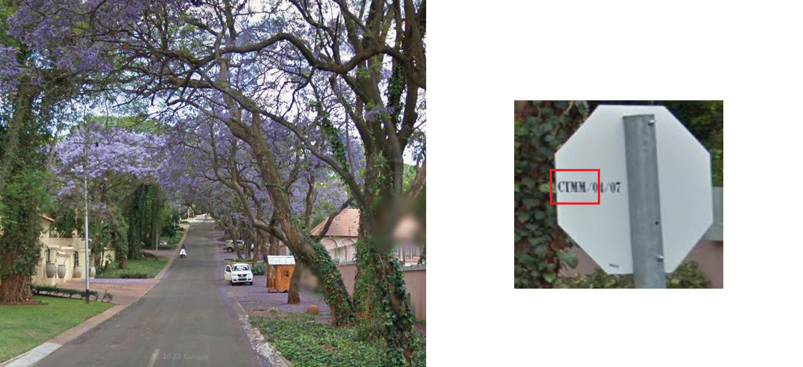
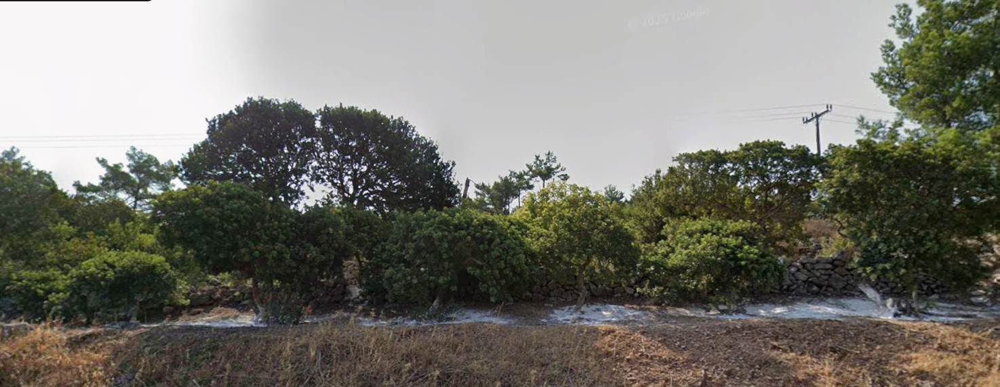
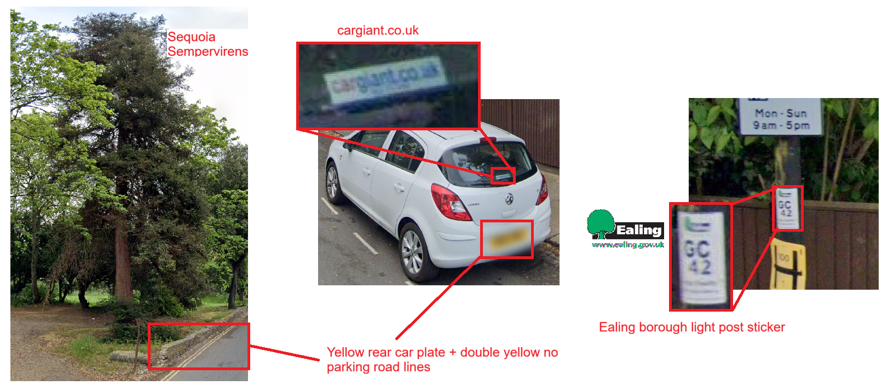
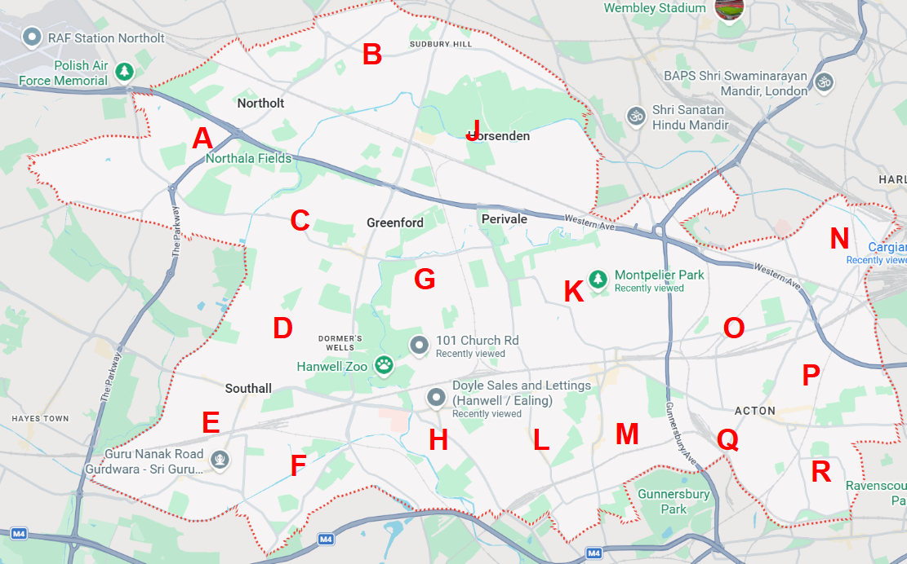
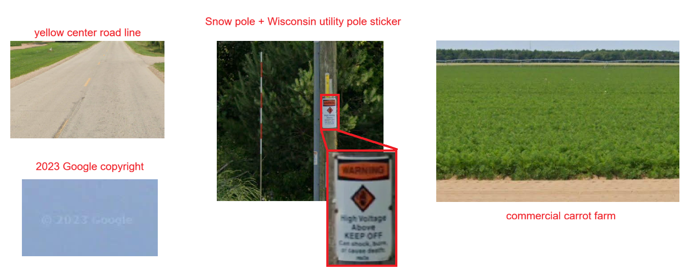

# Solution

*Have you touched grass yet?*

Most geo-OSINTs I see in CTFs either feel random or of poor quality. The goal with my challenge is a more focused approach, honing in on **5 different ways** vegetation can be useful for OSINT and also to expose players to the wide range of open source tools/knowledge that exist to aid us in doing so. 
I generally try to stray away from anything that requires too much Geoguessr-specific knowledge, though given the nature of these challenges they will often be somewhat helpful.

>*It's all in the trees, you see. ~ Sam, Jet Lag season 9 episode 3*

### 1. bicycle

>**Endemism**
>Through isolation or specialized adaptation, some plants evolve to be endemic. They are a fantastic clue as to *where* an image is taken.

1. Reverse image search the unique plant. It is **Opuntia Galapageia** (Galápagos prickly pear cactus), **endemic** to Galápagos islands
2. Through reverse image search or trial-and-error on Street View, recognise that this is somewhere along the stretch of road in Isla Isabela towards the Wall of Tears.

**Answer: Puerto Villamil, Galápagos, Ecuador** [-0.963,-91.006](https://maps.app.goo.gl/mfEgQgLLKG9HFogG9)

### 2. violet

>**Phenology**
>For plants that exhibit seasonal blooming, observing their state in an image provides a good benchmark of *when* that image was taken

1. These are **Purple Jacaranda** trees in full bloom. Jacarandas are native to Brazil but were introduced as ornamental trees in many parts of the World, notably in cities in Australia and South Africa. (Ironically, they are now considered alien invasive species in both those places.) 
2. The 'CTMM' on the back of the stop sign refers to '**City of Tshwane Metropolitan Municipality**'. Within that jurisdiction, only the city of **Pretoria** is known for Jacarandas.
3. Jacarandas at full bloom in Pretoria occurs in [**October**](https://thinkadventure.guide/explore/pretoria-things-to-do/where-to-view-jacaranda-trees-in-bloom-in-pretoria-a-complete-walking-guide/).
4. Search for [where to see Jacarandas in Pretoria](https://www.inyourpocket.com/johannesburg/where-to-see-pretorias-jacaranda-spring_78537f). This gives us a good starting list of locations to sift through.
5. Proceed to investigate each district on Google Street View...

| Districts | Elimination Criteria |
|---|---|
| Arcadia, Sunnyside, Eastwood | No October coverage |
| Groenkloof | October coverage taken too late/early, no flowers |
| Riviera, Hatfield | October coverage only on main road, this is a residential area |
| City Center | This is a residential area |
| Muckleneuk | Only has October 2009 coverage with wrong camera quality ([gen2](https://geohints.com/meta/cameraGens)) |
| Brooklyn, Waterkloof | - |
6. Investigate every intersection in Brooklyn and Waterkloof

**Answer: Rose Avenue, Pretoria, South Africa** [-0.963,-91.006](https://maps.app.goo.gl/boNgpPHu7TNDtguX6)

### 3. tears

>**Geocultural Cultivars**
>Due to culture or geographical conditions, communities can develop hyper-localised agricultural practices that create visually unique agricultural landscapes.

1. The most interesting thing in the scene is the row of shrubs with white powder underneath
2. Reverse image search the plants - they are **Mastic trees**. Though mastic shrubs are found all throughout the Mediterranean, they are only cultivated into trees (using a special technique that involves scattering white calcium carbonate at the base) in **South Chios, Greece**. This specific variety produces mastic resin aka tears of Chios. 
3. Specific microclimatic conditions mean the mastic trees are only grown in **24 mastic villages** aka **[Mastichochoria](https://www.gummastic.gr/en/mastihavillages/villages)**
4. Search roads in and around each village. Mastic tree groves are often located along the highways connecting neighboring mastic villages. Because I like rewarding systematic thinking and the usage of official sources, if you used the link above (official Mastichochoria site), this location is close to the very first village listed.

**Answer: Επαρ.Οδ. Χίου-Ελάτας, Chios, Greece** [38.308,26.036](https://maps.app.goo.gl/MbLWvyf2jCJkEL6s6)

### 4. california

>**Tree Maps**
>Many countries/cities maintain maps or lists that catalogue plants. This can include trees, unique plants or even plants with protected statuses.

1. Obviously this is not California. But we do have a huge **Sequoia sempervirens** (Coastal Redwood), which is native to California.
2. There are double yellow no parking road lines and a vehicle with a rear yellow plate -> **United Kingdom**
3. The rear windscreen of the white car features the website [Cargiant.co.uk](https://www.cargiant.co.uk/), a company that operates exclusively in **London**.
4. The lamp post features a white sign with the text 'GC42' and a little green logo. Though it is too small to see, you can compare it with the [London borough logos](https://dnco.com/thinking/londons-logos-decoded) and it's very obviously the borough of **Ealing**.
5. Using the [London Tree Map](https://apps.london.gov.uk/public-realm-trees/explore) search through redwood trees in the borough of Ealing. There are only 10.

#### BONUS: Alternative Solution
Ealing lamp posts are labelled with this format '**xC####**', that is a letter from A-Q preceding 'C' and then a number. The first letter corresponds to an area in Ealing (though I couldn't find this officially stated anywhere, the pattern can easily be observed on Google Maps street view). I have very kindlly created a rough map to demonstrate this:

G is approximately around the **Greenford** area. The '####' number on the lamp posts are consecutive for neighboring lamp posts on the same street but not consecutive across streets. It's thus possible to just check every street around Greenford until you find a lamp post with a similar number, and you'd likely be somewhere on the right street.

**Answer: 101 Church Road, London, United Kingdom** [51.515,-0.341](https://maps.app.goo.gl/bLxnLZw3qULmsGYq8)  
*^^ I think Google Maps removed that streetview image but this is the neighboring image, taken on the same date*

### 5. root
>**Geospatial data (GIS)**
Open-source vegetation/environmental data is a great tool for geolocating images

1. Yellow center road lines + general landscape + snow pole -> colder part of North America
2. Utility poles feature **white and orange warning stickers** -> [Wisconsin & Upper Michigan peninsula](https://learnablemeta.com/images/1955/1749644225724-TmC.avif)
3. Reverse image search the crops. They are **carrots**. 
4. The Google copyright on the panorama is 2023. The copyright year is always equal to or more recent than the year the image was actually captured. -> this image is from **2023 or earlier**.
5. With that in mind, we can use [USDA GIS crop data](https://croplandcros.scinet.usda.gov/), filter for **carrots** in **Wisconsin/upper Michigan peninsula** starting in **2023**
6. Check the roads around the marked out carrot fields. (Lucky for you, the copyright date is in fact accurate.)

#### Alternative Solution
Considering the commercial irrigation system, this is quite a sizeable commercial/industrial carrot farm, not a personal plot. Most of the carrot farms in Wisconsin are in the central and south-eastern regions. Top results for Wisconsin carrot farms are all located in Almond and Wautoma. If you just searched all the roads in the area in between them, you'd eventually look through Plainfield and you'd find it in the end.

**Answer: 5572 County Rd B, Wisconsin, United States** [44.180,-89.446](https://maps.app.goo.gl/HYGHwCEcr2ZiZHM4A)  

### Flag
**LNC26{Y_70ucH_9r45$_w3n_u_c4N_57uDy_gR4S5_206d97289a686b14aa91189ede9e4df8}**

### Resources
1. London Tree Map: [https://apps.london.gov.uk/public-realm-trees/explore](https://apps.london.gov.uk/public-realm-trees/explore)
2. USDA GIS Cropland Data: [https://croplandcros.scinet.usda.gov/](https://croplandcros.scinet.usda.gov/)
3. Plonkit Guide - country specific infrastructure[https://www.plonkit.net](www.plonkit.net)